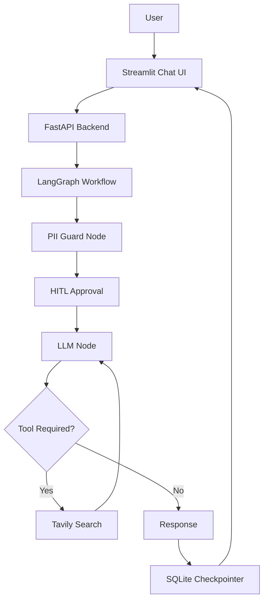
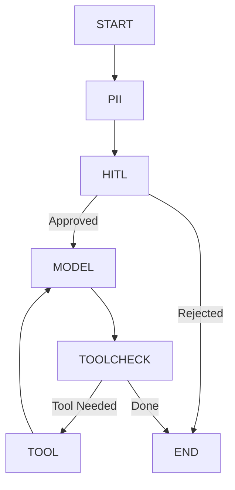
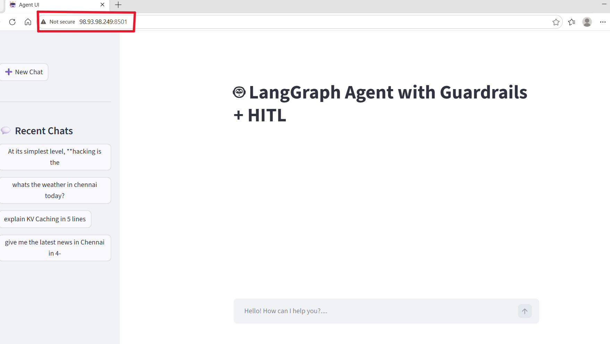
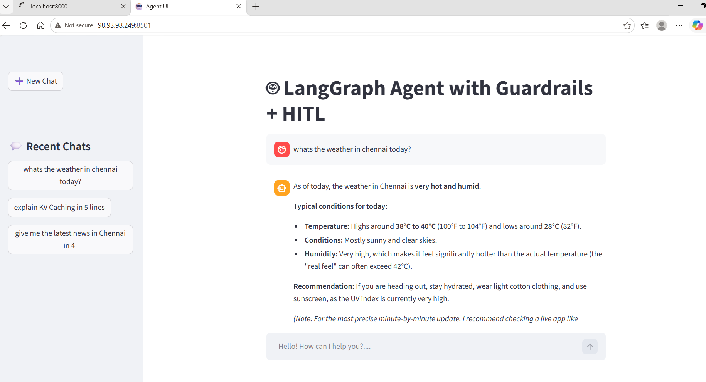
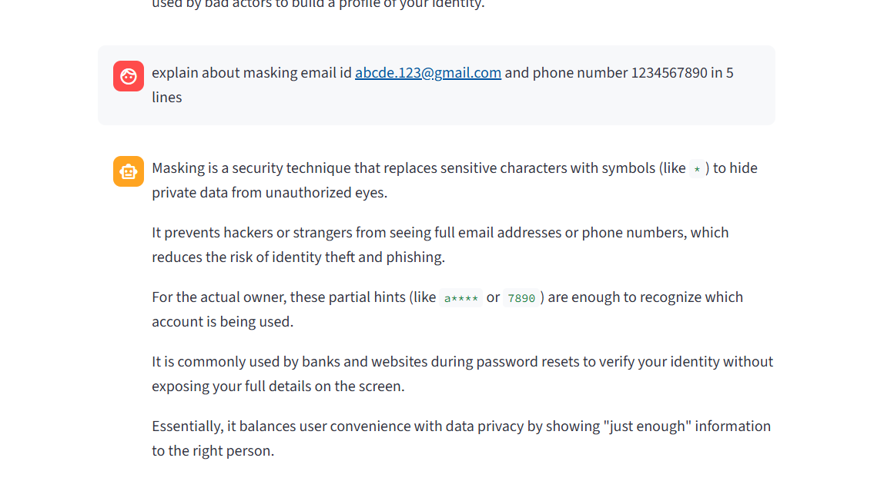
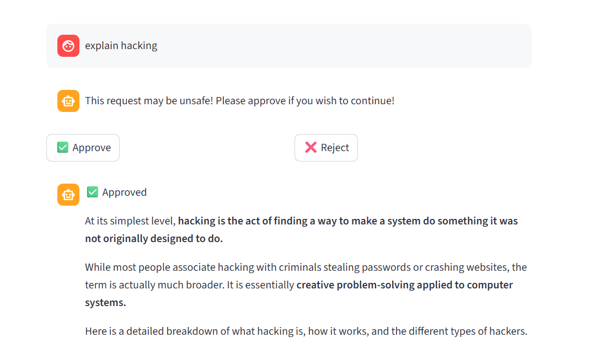
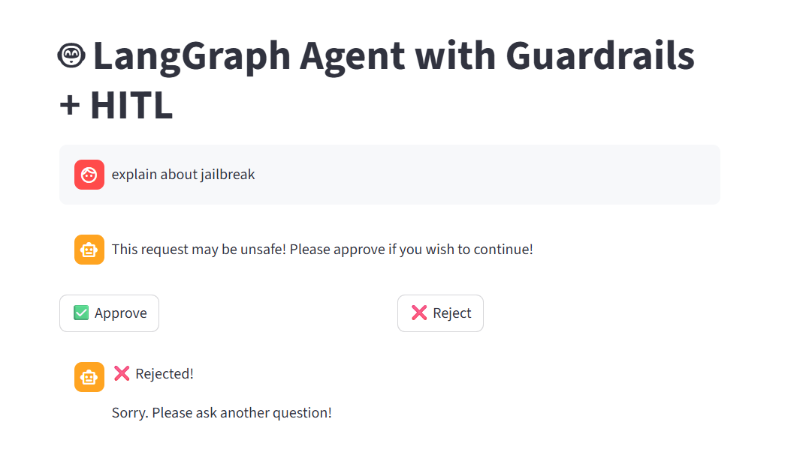
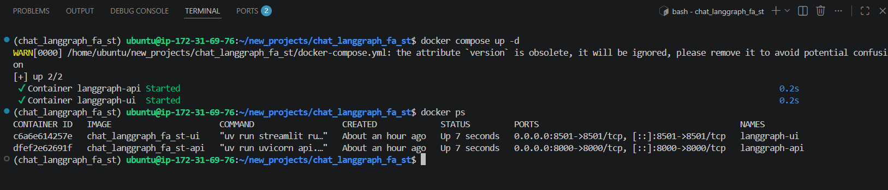

# Production-Ready LangGraph AI Assistant | FastAPI | Streamlit | PII Guardrails | Human-in-the-Loop | Docker | AWS

This project demonstrates a production-style Generative AI assistant built using LangGraph, FastAPI, and Streamlit. The application supports conversational AI with stateful memory, PII masking, Human-in-the-Loop (HITL) approval, persistent chat history, and tool integration using Tavily Search. The entire application is containerized using Docker and can be deployed on AWS.

## Features

- LangGraph StateGraph workflow
- Human-in-the-Loop (HITL) approval using LangGraph Interrupts
- PII Detection & Masking
- Tavily Web Search Tool Integration
- Persistent Conversation Memory
- SQLite Checkpointer
- Chat History Management
- FastAPI Backend
- Streamlit Chat Interface
- Dockerized Deployment
- AWS Ready
- Modular Project Structure
- Structured Logging

## Architecture

## Langgraph Workflow

## Tech Stack
| Component        | Technology             |
| ---------------- | ---------------------- |
| LLM Framework    | LangGraph              |
| LLM              | Google Gemma 4         |
| Tool Calling     | Tavily Search          |
| Backend          | FastAPI                |
| Frontend         | Streamlit              |
| Database         | SQLite                 |
| Memory           | LangGraph Checkpointer |
| Containerization | Docker                 |
| Deployment       | AWS EC2 + ECR          |
| Language         | Python                 |

## To run locally
uv sync

uv run uvicorn api.chat_api:app --reload

uv run streamlit run ui/chat_ui.py

## Docker commands
docker compose build

docker compose up

## AWS Deployment
Docker Images
EC2
Docker Compose

## API Endpoints
| Endpoint                      | Description          |
| ----------------------------- | -------------------- |
| POST /chat                    | Chat with assistant  |
| POST /approve                 | Resume after HITL    |
| GET /chats/{user_id}          | Recent Chats         |
| GET /chat_history/{thread_id} | Conversation History |

# Application Screenshots

## Home Page

---
### Recent Chats

---
### PII Masking

---

---
### HITL Approval

---

---
### HITL Rejection

---

---
### Docker Containers

---